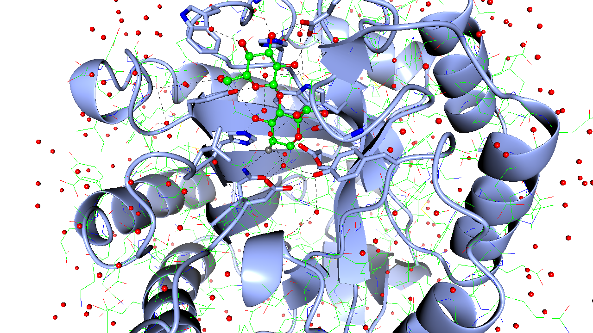

# glTF Vulkan C++ examples

A couple of C++ examples for [Vulkan®](https://www.khronos.org/vulkan/), the new generation graphics and compute API from Khronos. This is
a fork of Sascha Willems' base code and a couple of examples. The examples here render molecular graphics scenes in glTF files.

The only real changes are to permit rendering of different primitive types and the merging of glTF rendering and headless rendering.

The aim is to continue merging aspects of different tutorial/examples to make fully featured program. And also to load more typical
crystallographic data types: PDB, mmCIF, mtz, map, etc.

## Table of Contents
+ [Official Khronos Vulkan Samples](#official-khronos-vulkan-samples)
+ [Cloning](#Cloning)
+ [Assets](#Assets)
+ [Building](#Building)
+ [Running](#Running)
+ [Shaders](#Shaders)
+ [A note on synchronization](#a-note-on-synchronization)
+ [Examples](#Examples)
    + [glTF](#glTF)
+ [Credits and Attributions](#credits-and-attributions)

## Official Khronos Vulkan Samples

Khronos recently made an official Vulkan Samples repository available to the public ([press release](https://www.khronos.org/blog/vulkan-releases-unified-samples-repository?utm_source=Khronos%20Blog&utm_medium=Twitter&utm_campaign=Vulkan%20Repository)).

You can find this repository at https://github.com/KhronosGroup/Vulkan-Samples

## Cloning
```
git clone --recursive https://github.com/stuartjamesmcnicholas/VulkanCCP4.git
```

Existing repositories can be updated manually:

```
git submodule init
git submodule update
```

## Assets
Many of the Willems examples require assets from the asset pack that is not part of this repository due to file size. A python script is included to download the asset pack that. Run

    python download_assets.py

from the root of the repository after cloning or see [this](data/README.md) for manual download.

## Building

The repository contains everything required to compile and build the examples on  Windows,  Linux,  Android,  iOS and macOS (using Vulkan SDK/MoltenVK) using a C++ compiler that supports C++11.

This fork has been tested on: 
- Intel 2017 MacBook Pro, macOS Monterey
- Intel 2014 MacBook Pro, macOS Big Sur
- M1 2020 MacBook Pr, macOS Monterey
- Gigabyte BRIX GB-BMCE-5105, Intel Celeron, Intel UHD Graphics, Ubuntu 21.10
- Raspberry Pi 400, Rapsberry Pi OS Bullseye

The Macs and BRIX have been tested with the [Vulkan SDK 1.3.204](https://vulkan.lunarg.com/sdk/home).  
After installing SDK (in my case in $HOME), the necessary environment variables are setup with:
```
. $HOME/VulkanSDK/1.3.204.1/setup-env.sh
```
Installing the SDK may not be necessary on Linux, the OS may have the required bits installed - Raspberry Pi OS does, see below.

The Raspberry Pi required the lastest Vulkan-enabled Mesa to be built:
```
git clone -b 20.3 https://gitlab.freedesktop.org/mesa/mesa.git
cd mesa
EXTRA_PARAM="-mcpu=cortex-a72 -mfpu=neon-fp-armv8 -mfloat-abi=hard"
meson --prefix /home/pi/local -Dgles1=disabled -Dgles2=enabled -Dplatforms=x11 -Dvulkan-drivers=broadcom -Ddri-drivers= -Dgallium-drivers=v3d,kmsro,vc4,virgl -Dbuildtype=release -Dc_args="$EXTRA_PARAM" -Dcpp_args="$EXTRA_PARAM" build
ninja -C build
ninja -C build install
```

I installed in `/home/pi/local`, you can do anywhere, I think even `/usr`.

After (optionally) installing Vulkan SDK, simply do:
```
cmake .
make
```

On Linux there are also other, experimental, ways to build, these are for testing Gtk4 integration. **See 'Running' information below.**
- `cmake -DUSE_XLIB=1 .` This builds with Gtk with X11 backend support. This version is quite funcional, but Gtk does no more than create a Window.
- `cmake -DUSE_WAYLAND_WSI=1 .` This builds the program to use Wayland surfaces, rather than X11. This is functional but has no window decorations.
- `cmake -DUSE_WAYLAND_WSI=1 -DUSE_GTK=1 .` This builds with Gtk with Wayland backend support. This version is quite broken at the moment.

This fork has not yet been tested on Windows or Android. There are expected to be errors on Android.

## Running

run with e.g.:

```
bin/ccp4vulkan -filein data/models/ribbons.gltf
```

Multiple `-filein` options can be given.

The list of available command line options can be brought up with `--help` **Not all of these have any
effect in the CCP4Vulkan fork!**:
```
 -v, --validation: Enable validation layers
 -br, --benchruntime: Set duration time for benchmark mode in seconds
 -vs, --vsync: Enable V-Sync
 -w, --width: Set window width
 -f, --fullscreen: Start in fullscreen mode
 --help: Show help
 -h, --height: Set window height
 -bt, --benchframetimes: Save frame times to benchmark results file
 -s, --shaders: Select shader type to use (glsl or hlsl) (This option will not work in this fork.)
 -b, --benchmark: Run example in benchmark mode
 -g, --gpu: Select GPU to run on
 -bf, --benchfilename: Set file name for benchmark results
 -gl, --listgpus: Display a list of available Vulkan devices
 -bw, --benchwarmup: Set warmup time for benchmark mode in seconds
```

On the Pi, to make sure the correct driver is used set the following environment variables before running. (`LD_LIBRARY_PATH` may not be necessary, it
depends where you installed the library; `VK_ICD_FILENAMES` probably is required):
```
export VK_ICD_FILENAMES=$HOME/local/share/vulkan/icd.d/broadcom_icd.armv7l.json
export LD_LIBRARY_PATH=$HOME/local/lib/
```

If you have built one of the experimental versions, there are important enviroment variables that must be set:

- If you configured with `cmake -DUSE_XLIB=1 .` , then you must run with e.g.:
```GSK_RENDERER=cairo GDK_BACKEND=x11 bin/ccp4vulkan -filein data/models/ribbons.gltf```
- If you configured with `cmake -DUSE_WAYLAND_WSI=1 -DUSE_GTK=1 .` , then you must run with e.g.: 
```GDK_BACKEND=wayland bin/ccp4vulkan -filein data/models/ribbons.gltf```

## Shaders

Vulkan consumes shaders in an intermediate representation called SPIR-V. This makes it possible to use different shader languages by compiling them to that bytecode format. The shader language used here is [GLSL](data/shaders/glsl).

## A note on synchronization

Synchronization in the master branch currently isn't optimal und uses ```vkDeviceQueueWaitIdle``` at the end of each frame. This is a heavy operation and is suboptimal in regards to having CPU and GPU operations run in parallel. Sascha Willems is currently reworking this in the [this branch](https://github.com/SaschaWillems/Vulkan/tree/proper_sync_dynamic_cb). While still work-in-progress, if you're interested in a more proper way of synchronization in Vulkan, please take a look at that branch.


## Examples

### glTF

These samples show how implement different features of the [glTF 2.0 3D format](https://www.khronos.org/gltf/) 3D transmission file format in detail.

#### [glTF model loading and rendering](examples/ccp4vulkan/)

This is a modified version of a Sascha Willems' example.

Shows how to load a complete scene from a [glTF 2.0](https://github.com/KhronosGroup/glTF) file. The structure of the glTF 2.0 scene is converted into the data structures required to render the scene with Vulkan.

This version loads a glTF scene from CCP4MG (via an intermediary jiffy); this modified version can also draw lines and triangle strips. Fog and clip
sliders are provided, and a background colour edit. It can output screenshots via copy of swap chain images or using headless rendering (see below).

#### [glTF headless rendering](examples/renderheadless/)

This is a modified version of Sascha Willems' `renderheadless` example, refactored so that it can load a glTF file and also be called from
other programs, e.g. ccp4vulkan above.

## Credits and Attributions
See [CREDITS.md](CREDITS.md) for additional credits and attributions.

## Screenshot

